简单介绍一下JDK中bin目录下的一些常用工具，主要是参照《深入理解Java虚拟机：JVM高级特性与最佳实践》一书，感兴趣的可以去[购买](https://item.jd.com/10024051822795.html)该书。


## 一、JDK命令行工具


### 1.jps （JVM Process Status Tool）: 虚拟机进程状况工具

用于列出正在运行的虚拟机进程，并显示虚拟机执行主类（Main Class，main()函数所在的类）的名称，以及这些进程的本地虚拟机的唯一ID（LVMID，Local Virtual Machine Identifier）。对于本地虚拟机进程来说，LVMID与操作系统的进程ID（PID， Process Identifier）是一致的。

命令格式：

```
jps [ options ] [ hostid ]
```


### 2.jstat （JVM Statistics Monitoring Tool）: 虚拟机统计信息监视工具

用于监视虚拟机各种运行状态信息。可以显示本地或远程虚拟机进程中的类装载、内存、垃圾收集、[JIT编译](https://baike.baidu.com/item/JIT%E7%BC%96%E8%AF%91/2886569?fr=aladdin)等运行数据，是运行期间定位虚拟机性能问题的首选工具。

命令格式：

```
jstat [ option vmid [interval[s|ms] [count]] ]
```

jstat工具主要选项：

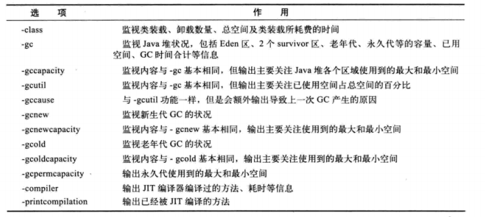


### 3.jinfo（Configuration Info for Java） : Java配置信息工具

用于实时查看和调整虚拟机的各项参数

命令格式

```
jinfo [ option ] pid
```


### 4.jmap（Memory Map for Java） : 内存映像工具

用于生成堆转存快照（一般称为heapdump或dump文件）。也可以查询finalize执行队列，Java堆和永久代的详细信息，如空间使用率、当前用的是哪种收集器等。

命令格式：

```
jmap [ option ] vmid
```

jmap工具主要选项

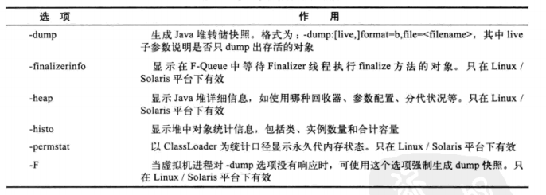


### 5.jhat（JVM Heap Analysis Tool）: 虚拟机堆转储快照分析工具

用于分析jmap生成的堆转储快照


### 6.jstack（Stack Trace for Java） : Java堆栈跟踪工具

用于生成虚拟机当前时刻的线程快照（一般称为threaddump或javacore文件）。生成线程快照的主要目的是定位线程出现长时间停顿的原因，如线程之间死锁、死循环、请求外部资源导致的长时间等待等都是导致线程长时间停顿的常见原因。

线程快照就是当前虚拟机内每一条线程正在执行的方法堆栈的集合。

命令格式：

```
jstack [ option ] vmid
```


jstack工具的主要选项

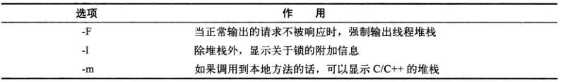


## 二、JDK可视化工具


### 1.JConsole（Java Monitoring and Management Console）: Java监视与管理控制台


#### (1) 启动JConsole

启动JConsole后，将自动搜索出本机运行的所以虚拟机进程，不需要再使用jps来查询了。

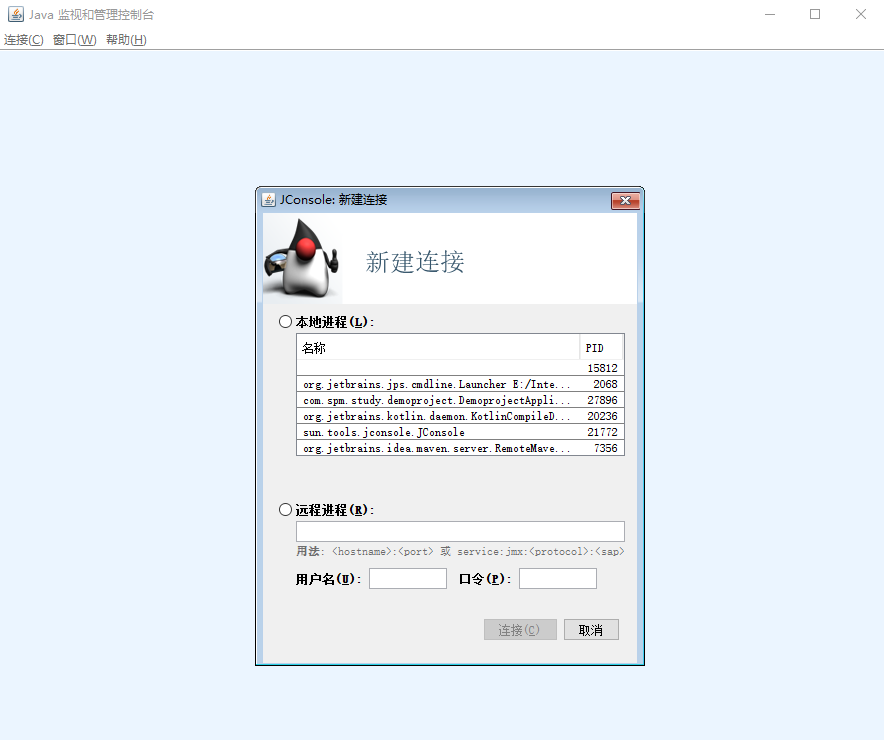


进入JConsole主界面，可以看到主界面共包括“概述”、“内存”、“线程”、“类”、“VM概要”和“MBean"六个页签，如下图所示。


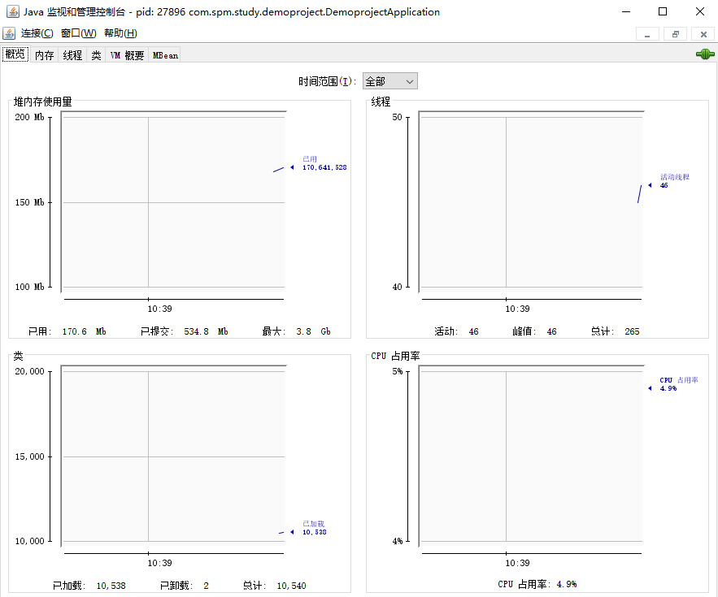

概述页签显示的是整个虚拟机主要运行数据的概述，包括”堆内存使用情况“、”线程“、”类“、”CPU使用情况“四项信息的曲线图。

#### (2) 内存监控

“内存”页签相当于可视化的jstat命令，用于监视受收集器管理的虚拟机内存（Java堆和永久代（JDK1.8以后改为元空间了））的变化趋势。

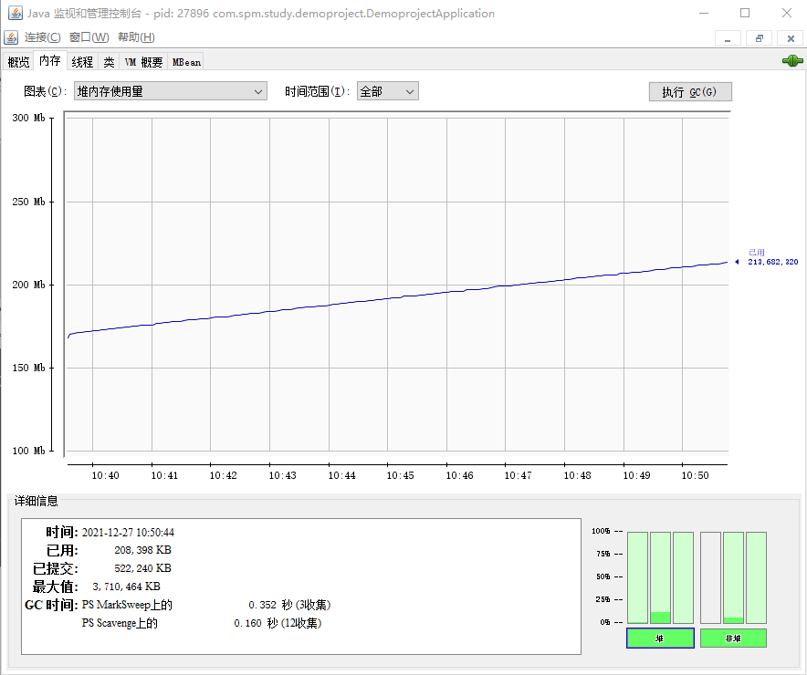


#### (3) 线程监控

“线程”页签的功能相当于可视化的jstack命令，遇到线程停顿的时候可以使用这个页签进行监控分析。

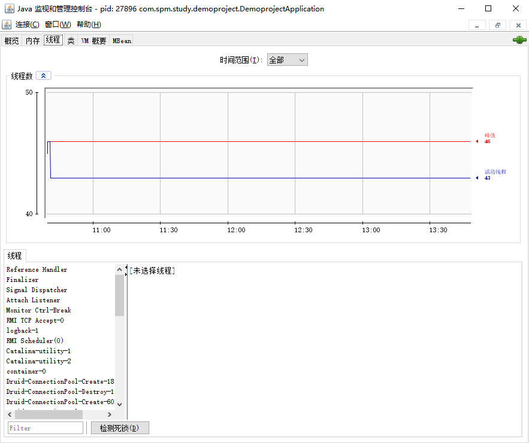


### 2.VisualVM（All-in-One Java Troubleshooting Tool） : 多合一故障处理工具

除了拥有运行监视、故障处理的功能外，还拥有很多其他方面的功能。如性能分析（Profiling），而且VisualVM还有一个很大的优点：不需要被监视的程序基于特殊Agent运行，因此它对应用程序的实际性能的影响很小，使得它可以直接应用在生产环境中。这个优点是JProfiler、YourKit等工具无法与之媲美的。

#### (1) 插件安装

VisualVM精华的功能在于可以安装插件。在有网络的情况下，点击“工具”-->“插件”菜单，弹出如下图所示的插件页签，在页签的“可用插件”中列举了当前版本VisualVM可以使用的插件，选中插件后在右边窗口将显示插件的基本信息，如开发者、版本、功能描述等。

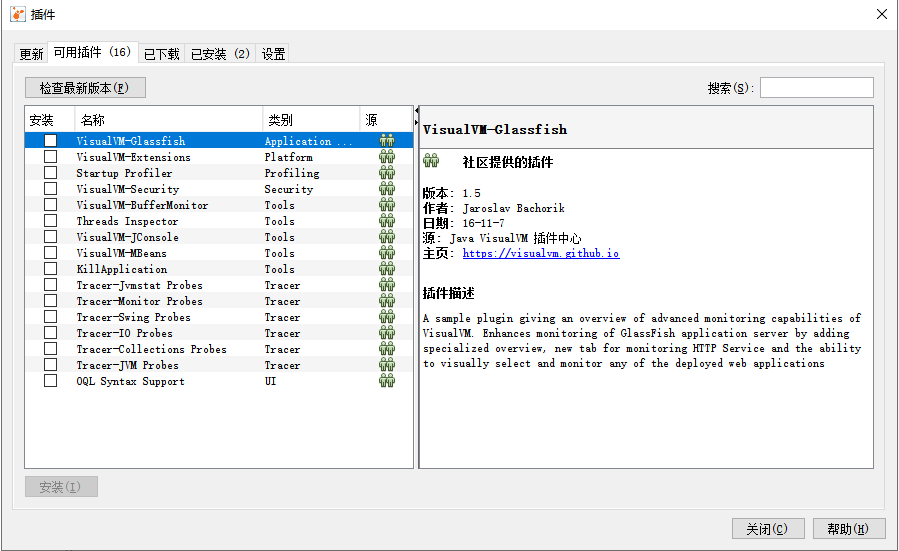

VisualVM的“概述”、“监视”、“线程”、“MBeans"的功能和前面介绍的JConsole差别不大。

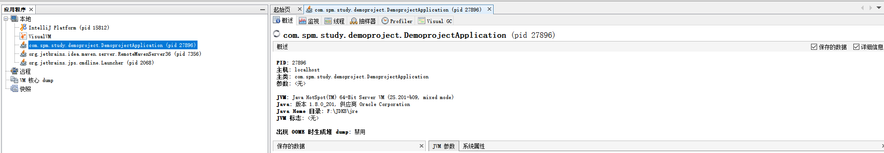

#### (2) 生成和浏览堆转储快照

在VisualVM中生成dump文件有两种方式

a.在“应用程序”窗口中右键单击应用程序节点，然后选择“堆Dump”；

b.在“应用程序”窗口中双击应用程序节点以打开应用程序标签，然后在“监视”标签总单击“堆Dump"。

生成dump文件后，应用程序页签将在该堆的应用程序下增加一个子节点，如下图所示。如需保存或者发送，需要在该节点上右键选择“另存为”菜单，否则VisualVM关闭时会被当做临时文件删除。要打开一个dump文件，通过文件菜单中的“装入”功能，选择对应的dump文件即可。

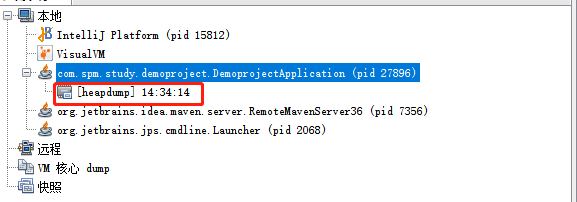


#### (3) 分析程序性能

在Profiler页签中，VisualVM提供了程序运行期间方法级的CPU执行时间分析及内存分析，进行分析会对程序运行性能产生较大的影响，一般不在生产环境中使用该项功能

开始分析前，先选择“CPU”和“内存”按钮中的一个，然后切换到应用程序中进行操作，VisualVM会记录这段时间中应用程序执行过的方法。如果是CPU分析，将会统计每个方法的执行次数、执行耗时；如果是内存分析则会统计每个方法关联的对象数及所占空间。

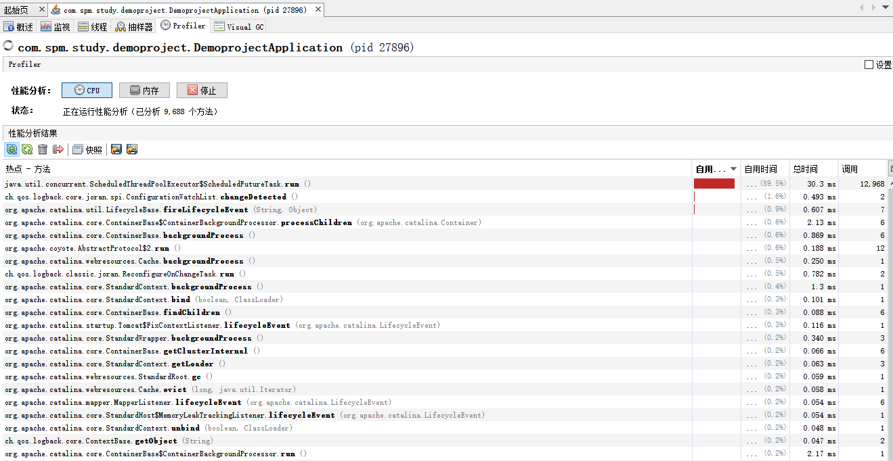


#### (4) BTrace动态日志跟踪

BTrace能在不停止目标程序运行的情况下，通过HotSpot虚拟机的HotSwap技术动态加入原本并不存在的调试代码。在安装BTrace插件后，应用程序面板右键点击要调试的程序，会出现“Trace Application"菜单，点击进入BTrace面板。

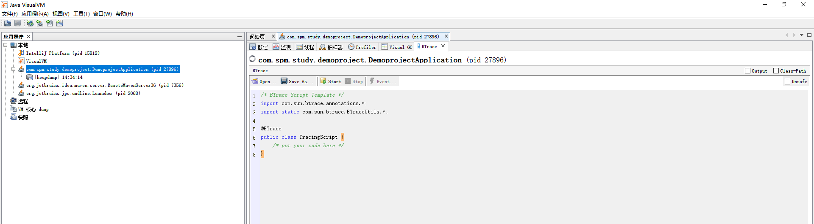


