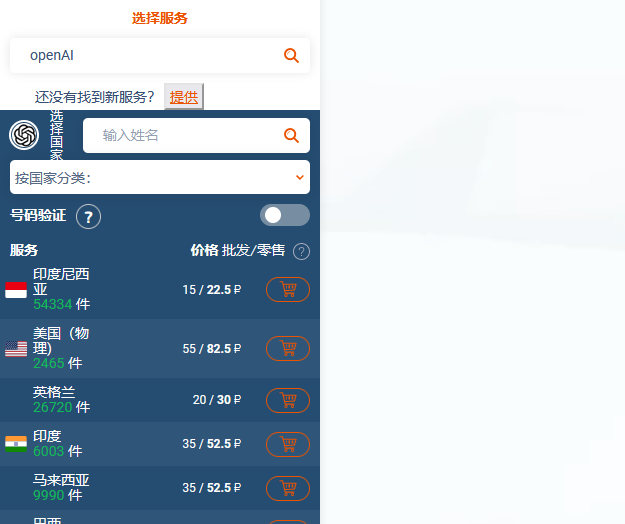
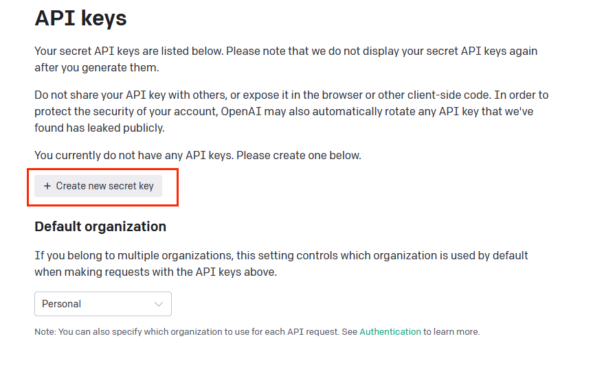
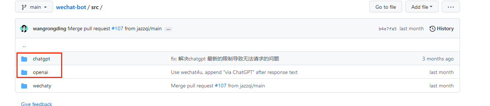
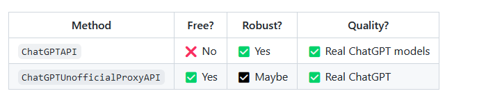
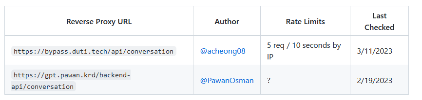
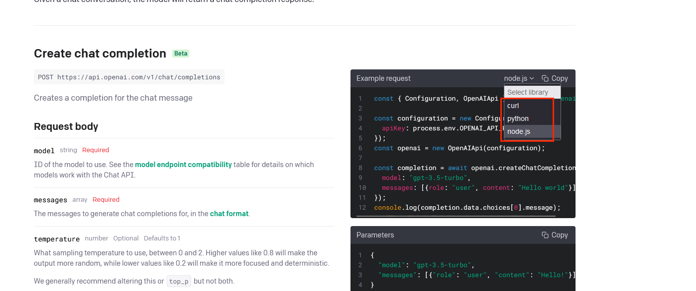
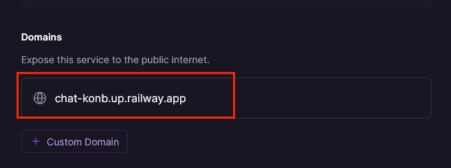

最近chatGPT还是比较火，也因为也比较感兴趣且刚好在github上看到一个把chatGPT做出微信机器人的项目，然后就去了解了下怎么弄，然后就出了这个教程把整个过程总结一下。

## 一、准备api key
### 1.注册openAI账号
- 准备一个邮箱
- 需要代理或者VPN才能进入[官网](https://platform.openai.com/)注册，而且需要是chatGPT支持的国家
- 需要一个国外的手机号，也需要是chatGPT支持的国家，可以去[这里](https://sms-activate.org/#)购买，也需要注册，支持支付宝，一次至少充值1美元，1美元最便宜的可以买两个号码，不过一定要先确认好chatGPT支不支持该国家
- 
以上都准备好了，就可以直接注册了，然后此时可以直接去[这里](https://chat.openai.com/)体验官网的chatGPT，如果想继续创建自己的应用就往下
### 2.创建api key
点击[这里](https://platform.openai.com/account/api-keys)创建api key，如下图所示

## 二、创建应用
### 1.使用github[项目](https://github.com/wangrongding/wechat-bot)
该项目是nodeJS，fork或者直接拉到本地都行，如果想部署在外网就fork，部署本地就拉到本地，不过都需要准备好代理地址
该项目默认提供了两种方式，如下图

- chatgpt就是连接到chatGPT3.5，也是我们目前的目的，不过他用的不是官网的接口，也是一个GitHub的开源[项目](https://github.com/transitive-bullshit/chatgpt-api#update-december-11-2022)，该项目提供了两种接口，对比如下

第一种是收费的，1000token/0.002美元,这种也是我们目前用的，因为注册openAI会送18美元，所以个人可以用很久了
第二种免费的，但是用这个项目下的代理会封号，第一个失效，第二个很慢且会被封号，亲身经历

- openAI是官网提供的另一个AI模型，没有chatGPT强也挺不错了，且不需要代理，可以直接使用
### 2.修改代码
因为是调的接口，即使运行应用的机器跑了代理也不会起效，所以我们要修改请求方式，修改为如下代码就行
```js
const api = new ChatGPTAPI({
  apiKey: env.OPENAI_API_KEY,
  debug: false,
  fetch: (url, options = {}) => {
    const defaultOptions = {
      agent: proxy("代理地址"),
    };

    const mergedOptions = {
      ...defaultOptions,
      ...options,
    };

    return nodeFetch(url, mergedOptions);
  },
});
```
当然也可以使用官方提供的接口，去该[地址](), 官方提供了三种方式，不过需要自己探索代理请求的方法

为了保证chatGPT可以理解上下文进行对话，需要带上每次请求接口返回的id,代码如下所示，response是chatGPT的回复
```js
  let res = await oraPromise(
    api.sendMessage(content, {
      parentMessageId: id
    }),
    {
      text: content
    }
  )
  map.set(name, res.id)
  const response = res.detail.choices[0].message.content
```
### 3.修改配置
这个参照该项目的readme文件就好
### 4.部署
- 本地部署，很简单，参照作者的教程就好
- 外网部署，这里我一定要推荐[railway](https://railway.app/),该网站可以使用github登录，然后直接选择自己仓库的项目就可以一键部署，每个月会送5美元，个人使用完全足够了，没有域名的，部署完成后记得点击setting的这个地方生成一个域名，这个虽然简单，但是部署外网有风险，因为api key暴露在外网，要小心被被人薅了羊毛

## 三、备用
因为微信使用程序自动回复，会有风险被封号，**切记使用小号，切记使用小号，切记使用小号**，且不要加太多人使用，否则容易被封，自己用应该问题不大，不过备用方案是用网站，我目前还在开发一个双服务器的网站版的系统，一个外网java服务器进行消息转发，一个nodeJS服务器在本地请求chatGPT，前端就是一个聊天框，java服务器代码已上传，[点击前往](https://github.com/konb-hui/chat),后续会把nodeJS服务端代码和前端代码上传。