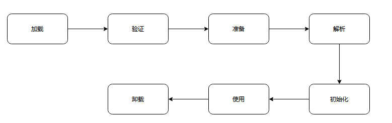
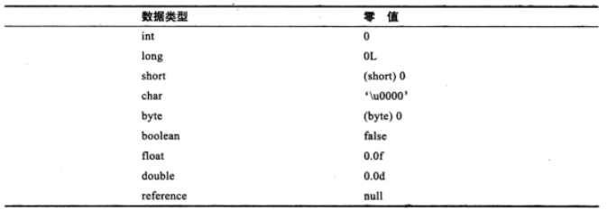
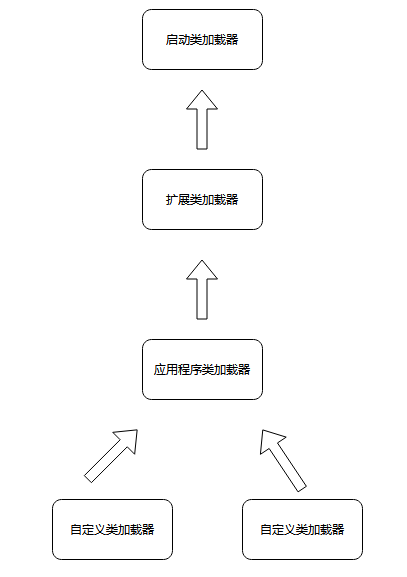

学过Java的都知道`.java`文件需要通过编译变成`.class`文件才能运行，那么Java虚拟机是如何把这些Class文件进行加载和运行的呢？

### 一、介绍

一个类从被加载进内存直到被从内存中卸载，整个生命周期主要包括：加载（Loading）、验证（Verification）、准备（Preparation）、解析（Resolution）、初始化（Initialization）、使用（Using）、卸载（Unloading）七个阶段。其中验证、准备、解析又可以总称为连接（Linking）。每个步骤的发生顺序见下图。

加载、验证、准备、初始化、卸载五个阶段是固定的，不过这个固定指的是开始的时间，实际上它们一般是交叉进行的。在某些情况，解析可能在初始化之后开始，为了支持Java语言的运行时绑定（动态绑定）。

### 二、类加载的过程

#### 2.1 加载

加载阶段虚拟机将会执行如下3件事：

- 通过一个类的全限定名来获取定义此类的二进制字节流；

- 将这个字节流所代表的静态存储结构转换为方法区运行时数据结构；

- 在Java堆生成一个代表该类的`Java.lang.Class`对象，作为方法区数据的访问入口。

针对于第一件事，虚拟机规范并没有指明字节流要从那里获取和怎样获取。很多Java技术都建立在这一基础上，例如：

- 从ZIP包中读取，最终成为日后JAR、EAR、WAR格式的基础

- 从网络中获取

- 运行时动态生成，即动态代理

- 由其他文件生成，如JSP

- 从数据库读取，有些中间件服务器可以选择把程序安装到数据库中来完成程序代码在集群间的分布

#### 2.2 验证

为了确保Class文件的字节流中包含的信息符合当前虚拟机的要求，并且不会危害虚拟机自生的安全。大致分为四个阶段：文件格式验证、元数据验证、字节码验证和符号引用验证。

##### （1）文件格式验证

用于验证Class文件的格式是否符合规范，可能包括以下部分：

- 是否以魔数0xCAFFBABY开头
- 主、次版本是否在当前虚拟机可处理范围内
- 常量池的常量是否有不被支持的类型
- 指向常量的各种索引值是否由指向不存在的常量或者不符合类型的常量
- CONSTANT_Utf8_info型的常量师傅有不符合UTF8编码的数据
- Class文件中各个部分及文件本身是否有被删除的或附加的其他信息

上面部分只是截取HotSpot虚拟机源码的一小部分。经过该阶段的验证后，字节流才会进入内存的方法区进行存储。

##### （2）元数据验证

对字节码描述的信息进行语义分析，保证符合Java语言规范。

##### （3）字节码验证

进行数据流和控制流的分析，对类的方法体进行校验分析，保证该类的方法在运行时不会做出危害虚拟机安全的行为。例如：

- 保证任意时刻操作数栈的数据类型与指令代码序列都可以配合工作。不会出现类似放置了一个int类型，却使用long类型来加载
- 保证指令跳转不会跳转到方法体以外的指令上去
- 保证方法体重的类型转发是有效的。例如子类可以赋值给父类，但父类不可以赋值给子类

##### （4）符号引用验证

对类自身以外（常量池中的各种符号引用）的信息进行匹配性的校验。

#### 2.3 准备

该阶段为类变量（static修饰的变量）分配内存并设置类变量初始值。

基本数据类型的零值

#### 2.4 解析

解析过程就是虚拟机将常量池中的符号引用替换为直接引用的过程。

- 符号引用：以一组符号来描述引用的对象，该符号可以是任何字面量，只要能够保证无歧义的定位到目标即可。符号引用与虚拟机实现的内存布局没有关系，不要求目标一定已加载到内存中。
- 直接引用：可以是直接指向目标的指针、相对偏移量或者一个能间接定位到目标的句柄。直接引用是与虚拟机实现的内存布局相关的，同一个符号引用在不同虚拟机翻译出来的直接引用一般不同。如果存在直接引用，那么目标必然已经存在内存中。

解析动作主要针对类或接口、字段、类方法、接口方法四类符号引用进行。

#### 2.5 初始化

该阶段是类加载过程的最后一步，会根据程序员定制的计划去初始化类变量和其他资源。

### 三、类加载器

#### 3.1 介绍

绝大部分Java程序都会使用到以下三种系统提供的类加载器

- 启动类加载器（Bootstrap ClassLoader）：负责将存放在`<JAVA_HOME>\lib`目录中的，或者被`-Xbootclasspath`参数所指定的路径中的，并且是虚拟机识别的类库加载到虚拟机内存中。该加载器无法被Java程序直接引用。
- 扩展类加载器（Extension ClassLoader）：有`sun.misc.Launcher$ExtClassLoader`实现，它负责加载`<JAVA_HOME>\lib\ext`目录中的，或者被`java.ext.dirs`系统变量所指定的路径中所有类库。可以直接使用扩展类加载器。
- 应用程序类加载器（Application ClassLoader）：由`sun.misc.Launcher$AppClassLoader`来实现。该加载器是`ClassLoader`中的`getSystemClassLoader()`方法的返回值，所以也被称作系统类加载器。负责加载用户类路径上所指定的类库，可以直接使用该加载器，且如果开发者没有自定义过类加载器，默认都是使用该加载器。

#### 3.2 双亲委派原则

如果一个类加载器收到了类加载的请求，它首先不会自己去尝试加载这个类，而是把这个请求委派给父类加载器去完成，每个层次的类加载器都是如此，因此所有的加载请求最终都应该加载到顶层的启动类加载器中，只有当父类加载器反馈无法完成这个加载请求时，子加载器才会尝试自己去加载。保证Java类随着它的加载器一起具备了一种带有优先级的层次关系。

