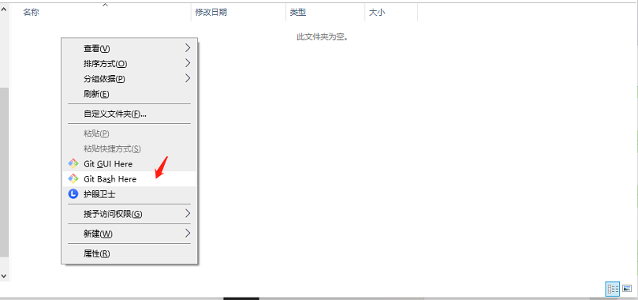
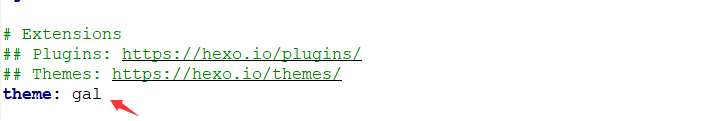
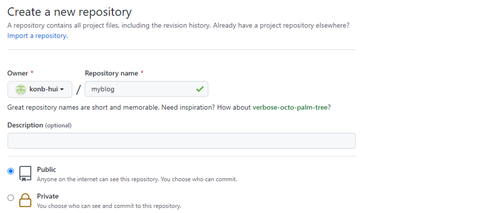
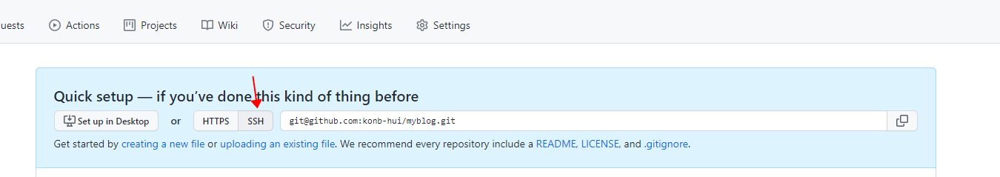
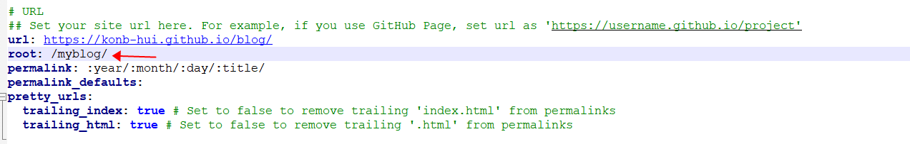
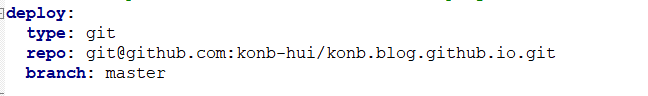
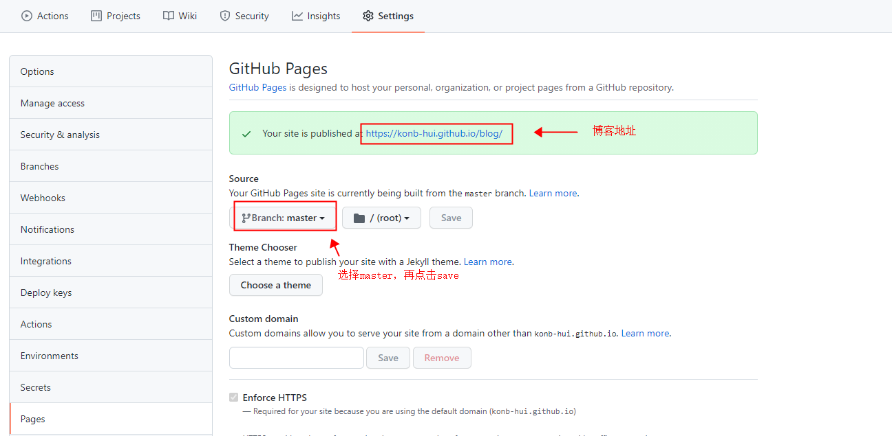

简单记录下自己博客的搭建过程。


## 一、准备环境


### 1.下载[node JS](https://nodejs.org/en/),安装

### 2.打开控制台安装cnpm

```sh
npm install -g cnpm --registry=https://registry.npm.taobao.org
```


### 3.安装Hexo(用于搭建博客的工具)

```sh
cnpm install hexo-cli -g
```


### 4.下载git，版本控制工具，点击前往[安装教程](https://www.runoob.com/git/git-install-setup.html)，需要配合GitHub或者Gitee账号使用


## 二、本地创建博客项目


### 1.新建一个文件夹用于保存项目文件，进入文件夹，右键选择如下图



### 2.点击后需要输入自己的邮箱和密码，若完成git安装教程应该已经保存邮箱和密码

### 3.输入`hexo init`，初始化仓库，稍加等待

### 4.输入`hexo s`，然后在浏览器输入localhost:4000，已经可以访问默认的博客

### 5.[点击前往 ](https://hexo.io/themes/), 选择自己喜欢的主题,如下为选择主题后下载的一个示例

`git clone https://github.com/ZEROKISEKI/hexo-theme-gal.git themes/gal`

### 6.输入如下命令下载必要插件，注意需要[安装python](https://www.runoob.com/python/python-install.html)   ，建议安装2.7版本，本人因为安装的是3.7的版本导致一直报错，后来切换2.7版本解决

```sh
cnpm install hexo-renderer-sass --save
cnpm install hexo-renderer-scss --save
cnpm install hexo-generator-json-content --save
```


### 7.使用文本编辑器打开如下文件并进行编辑，在末尾添加如下文本（若使用的不是示例中的主题，请忽略这步）

```properties
jsonContent:
  dateFormat: MM-DD
  pages:
    title: true
    text: true
    path: true
    date: true
    excerpt: true
    preview: true
  posts:
    title: true
    text: true
    path: true
    date: true
    excerpt: true
    tags: [{
      name: tag.name,
      slug: tag.slug,
      permalink: tag.permalink
    }]
    preview: true
```

### 8.切换下载的主题，如下图所示，修改为自己要切换的主题



### 9.输入如下命令，创建某些常用页面，更多Hexo命令[点击前往](https://hexo.io/zh-cn/docs/)

```sh
# 开启搜索功能
hexo new page "search"
# 配置错误页面
hexo new page "404"
```

### 10.再次执行`hexo s`,启动博客，此时该指令可能无效，原因是Hexo 3.0 把服务器独立成了个别模块，必须先安装 [hexo-server](https://github.com/hexojs/hexo-server) 才能使用

```sh
$ npm install hexo-server --save
```

### 11.开始创建和编写自己的文章，文章都是markdown文件，建议使用Typora,[点击前往下载测试版](https://pan.baidu.com/s/1V7s1YOvaJIUlXr04aObEzg)（正式版需要付费），提取码`pn5v`

### 12.编写完成后，执行`hexo g`，再`hexo s`重新启动


## 三、部署到Github

### 1.在Github上创建一个仓库




### 2.选择SSH链接，因为现在Github已经不支持在其他地方使用账号和密码登录



### 3.修改_config.yml文件，将root修改为和创建的仓库的名字一致，repo输入你自己的SSH地址，type和branch如下图所示





### 4.输入`hexo g`

### 5.安装hexo部署插件

```
cnpm install --save hexo-deployer-git
```

### 6.输入`hexo d`进行部署

### 7.刷新Github仓库，进入Settings->pages,选择branch，再save成功则生成博客地址

