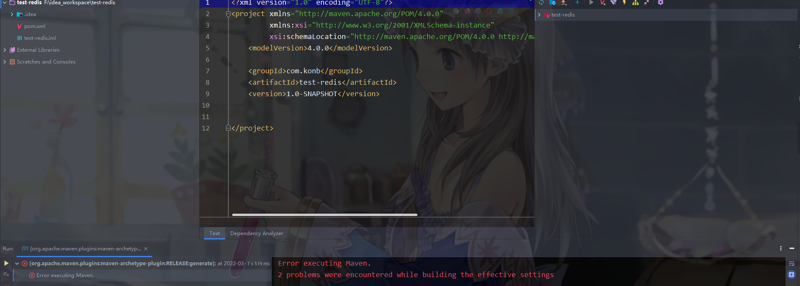
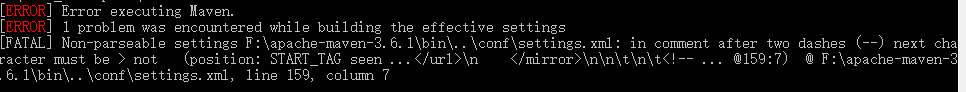
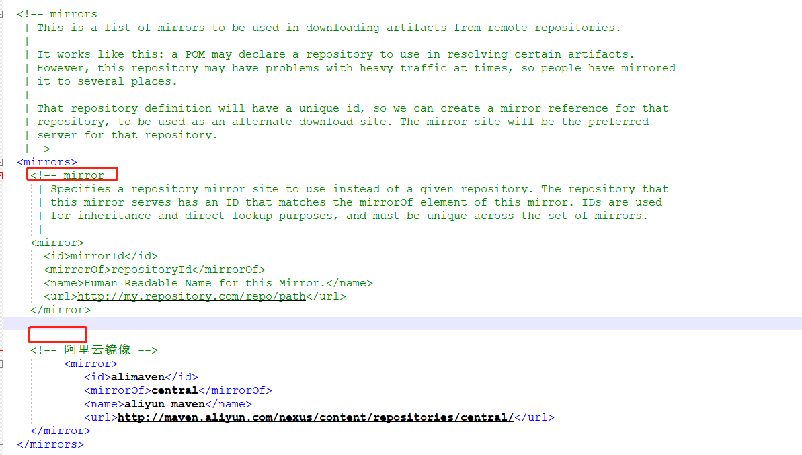

##### 【任务标题】

解决创建maven项目的报错

##### 【状态】

已解决

##### 【任务奖励】

铜币 * 50

##### 【要求时间】

马上

##### 【委托人】

村民A

##### 【任务详情】

昨天晚上我在使用idea创建maven项目的时候，初始化项目的时候报了如下错，初始化失败没有生成`src`文件，在idea使用maven的其他操作，如`clean`均会报这个错。

##### 【承接人】

konb

##### 【解决过程】

通过命令提示符直接执行`mvn clean`发现如下错误，可以看出是`setting.xml`配置文件出错了。

经过观察配置文件发现注释符号少了一半，这个其实也很坑，由于这个注释符号后面又紧接着一个注释，很难发现少了一半，因为notepad++还是会把这部分标绿，显示成注释的状态。加回另一半注释符号完美运行。

