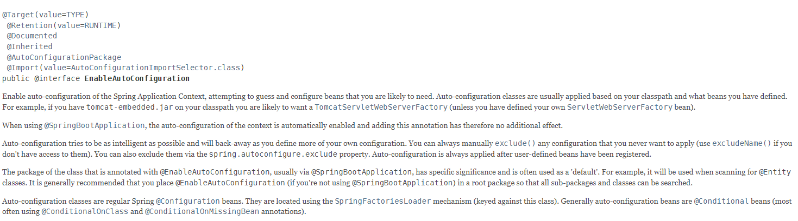

最近想了解下SpringBoot启动流程，网上看了些博客，但是一般都很简单，看得我云里雾里，所以决定自己一行一行分析源码，目标是尽可能知道每一行代码的作用。

首先看下启动类，如下代码，一个`main`方法，很简单，主要是两部分，`@SpringBootApplication`注解和`SpringApplication`调用的`run()`方法。

```java
@SpringBootApplication
public class WjApplication {
    public static void main(String[] args) {
        SpringApplication.run(WjApplication.class, args);
    }
}
```


上篇先讲下`@SpringBootApplication`注解，首先也看下源代码，然后一行行分析。

```java
@Target({ElementType.TYPE})
@Retention(RetentionPolicy.RUNTIME)
@Documented
@Inherited
@SpringBootConfiguration
@EnableAutoConfiguration
@ComponentScan(
    excludeFilters = {@Filter(
    type = FilterType.CUSTOM,
    classes = {TypeExcludeFilter.class}
), @Filter(
    type = FilterType.CUSTOM,
    classes = {AutoConfigurationExcludeFilter.class}
)}
)
public @interface SpringBootApplication {
    @AliasFor(
        annotation = EnableAutoConfiguration.class
    )
    Class<?>[] exclude() default {};

    @AliasFor(
        annotation = EnableAutoConfiguration.class
    )
    String[] excludeName() default {};

    @AliasFor(
        annotation = ComponentScan.class,
        attribute = "basePackages"
    )
    String[] scanBasePackages() default {};

    @AliasFor(
        annotation = ComponentScan.class,
        attribute = "basePackageClasses"
    )
    Class<?>[] scanBasePackageClasses() default {};

    @AliasFor(
        annotation = ComponentScan.class,
        attribute = "nameGenerator"
    )
    Class<? extends BeanNameGenerator> nameGenerator() default BeanNameGenerator.class;

    @AliasFor(
        annotation = Configuration.class
    )
    boolean proxyBeanMethods() default true;
}
```


### 1.`@Target({ElementType.TYPE})`

这个注解属于Java基础内容，一个数组元素，看注释说：返回注释类型可以应用于的元素种类的数组，因此这个注释就是用于指定`@SpringBootApplication`注解可添加到的类型。

```java
@Documented
@Retention(RetentionPolicy.RUNTIME)
@Target(ElementType.ANNOTATION_TYPE)
public @interface Target {
    /**
     * Returns an array of the kinds of elements an annotation type
     * can be applied to.
     * @return an array of the kinds of elements an annotation type
     * can be applied to
     */
    ElementType[] value();
}
```

`{ElementType.TYPE}`数组，只有一个元素，看下`ElementType`的源码，总共有10种，最后2种是JDK1.8新增的，然后TYPE类型，看注释可知用于`Class`, `interface (including annotation type)`,  `enum`。而我们上面的`WjApplication`就是`Class`类型。

```java
public enum ElementType {
    /** Class, interface (including annotation type), or enum declaration */
    TYPE,

    /** Field declaration (includes enum constants) */
    FIELD,

    /** Method declaration */
    METHOD,

    /** Formal parameter declaration */
    PARAMETER,

    /** Constructor declaration */
    CONSTRUCTOR,

    /** Local variable declaration */
    LOCAL_VARIABLE,

    /** Annotation type declaration */
    ANNOTATION_TYPE,

    /** Package declaration */
    PACKAGE,

    /**
     * Type parameter declaration
     *
     * @since 1.8
     */
    TYPE_PARAMETER,

    /**
     * Use of a type
     *
     * @since 1.8
     */
    TYPE_USE
}
```


### 2.`@Retention(RetentionPolicy.RUNTIME)`

该注解还是Java基础，看注释，返回一个保留策略，也就是说指定当前被修饰的注解会被保留多久

```java
@Documented
@Retention(RetentionPolicy.RUNTIME)
@Target(ElementType.ANNOTATION_TYPE)
public @interface Retention {
    /**
     * Returns the retention policy.
     * @return the retention policy
     */
    RetentionPolicy value();
}
```

看下参数`RetentionPolicy`源码，总共3中类型，`RUNTIME`看注释：注解会被编译器记录在`Class`文件中，运行时也会被虚拟机保存，可以通过反射获取。这种类型是保留时间最长的，和普通的类是一样的。

```java
public enum RetentionPolicy {
    /**
     * Annotations are to be discarded by the compiler.
     */
    SOURCE,

    /**
     * Annotations are to be recorded in the class file by the compiler
     * but need not be retained by the VM at run time.  This is the default
     * behavior.
     */
    CLASS,

    /**
     * Annotations are to be recorded in the class file by the compiler and
     * retained by the VM at run time, so they may be read reflectively.
     *
     * @see java.lang.reflect.AnnotatedElement
     */
    RUNTIME
}
```


### 3.`@Documented`

还是Java基础，添加这个注解后生成javadoc的时候会被记录。

```java
@Documented
@Retention(RetentionPolicy.RUNTIME)
@Target(ElementType.ANNOTATION_TYPE)
public @interface Documented {
}
```


### 4.`@Inherited`

看名字就可以知道，添加该注解后，注释会被自动继承，也就是说，如果有一个类继承了`WjApplication`，那么这个类也会带`@SpringBootApplication`注解。

```java
@Documented
@Retention(RetentionPolicy.RUNTIME)
@Target(ElementType.ANNOTATION_TYPE)
public @interface Inherited {
}
```


### 5.`@SpringBootConfiguration`

这个注解是SpringBoot特有的，主要分析`@Configuration`和`@AliasFor`注解。

```java
@Target({ElementType.TYPE})
@Retention(RetentionPolicy.RUNTIME)
@Documented
@Configuration
public @interface SpringBootConfiguration {
    @AliasFor(
        annotation = Configuration.class
    )
    boolean proxyBeanMethods() default true;
}
```


#### （1）`@AliasFor`

由`@Target({ElementType.METHOD})`可知该注解用于方法上。该注解主要有两个功能，添加别名和组合注解。

```java
@Retention(RetentionPolicy.RUNTIME)
@Target({ElementType.METHOD})
@Documented
public @interface AliasFor {
    @AliasFor("attribute")
    String value() default "";

    @AliasFor("value")
    String attribute() default "";

    Class<? extends Annotation> annotation() default Annotation.class;
}
```

##### a.添加别名

如下代码，path和value属性都互为别名，也就是说在使用这个注解的时候，参数写value = xx或者path = xx的效果是一样的。

注意：

- 互为别名的属性属性值类型，默认值，都是相同的；
- 互为别名的注解必须成对出现，比如 value 属性添加了`@AliasFor("path")`，那么 path 属性就必须添加`@AliasFor("calue")`；
- 另外还有一点，互为别名的属性必须定义默认值。

```java
@Target({ElementType.TYPE, ElementType.METHOD})
@Retention(RetentionPolicy.RUNTIME)
@Documented
@Mapping
public @interface RequestMapping {
    String name() default "";

    @AliasFor("path")
    String[] value() default {};

    @AliasFor("value")
    String[] path() default {};
    ...
}
```

##### b.组合注解

如下代码，设置`annotation = ComponentScan.class`和`attribute = "basePackages"`就代表给`@ComponentScan`注解的`basePackages`属性设置`scanBasePackages`别名，这样就可以加多个注解组合成一个注解。

```java
...
@AliasFor(
    annotation = EnableAutoConfiguration.class
)
String[] excludeName() default {};

@AliasFor(
    annotation = ComponentScan.class,
    attribute = "basePackages"
)
String[] scanBasePackages() default {};
...
```

#### （2）@Configuration

用于定义一个配置类，同时也是一个bean，因为有`@Component`注解。

```java
@Target({ElementType.TYPE})
@Retention(RetentionPolicy.RUNTIME)
@Documented
@Component
public @interface Configuration {
    @AliasFor(
        annotation = Component.class
    )
    String value() default "";

    boolean proxyBeanMethods() default true;
}
```

`@Component`注解，看下代码，该注解用于声明当前类作为Spring容器的bean

```java
@Target({ElementType.TYPE})
@Retention(RetentionPolicy.RUNTIME)
@Documented
@Indexed
public @interface Component {
    String value() default "";
}
```

`@Indexed`源码，这个注解简单来讲就是能给bean生成索引，提高SpringBoot启动时扫描bean文件的速度。它是如何提高的以后有机会再分析。

```java
@Target({ElementType.TYPE})
@Retention(RetentionPolicy.RUNTIME)
@Documented
public @interface Indexed {
}
```


### 6.`@EnableAutoConfiguration`

```java
@Target({ElementType.TYPE})
@Retention(RetentionPolicy.RUNTIME)
@Documented
@Inherited
@AutoConfigurationPackage
@Import({AutoConfigurationImportSelector.class})
public @interface EnableAutoConfiguration {
    String ENABLED_OVERRIDE_PROPERTY = "spring.boot.enableautoconfiguration";

    Class<?>[] exclude() default {};

    String[] excludeName() default {};
}
```

看下[官方API文档](https://docs.spring.io/spring-boot/docs/current/api/)的介绍，第一句话就介绍了这个注解的作用：通过用户配置的classpath自动加载可能需要的bean。

- ENABLED_OVERRIDE_PROPERTY ： 环境参数，当自动配置被启动时可以被重写。
- exclude ：设置不需要自动配置的类
- excludeName ：设置不需要自动配置的类名



#### （1）`@AutoConfigurationPackage`

注册自动扫描的包，如果没有声明基础包路径，则以当前注解所在的包作为自动扫描的包

- basePackages：字符串数组，设置基础包路径
- basePackageClasses：Class数组，设置基础包路径

```java
@Target({ElementType.TYPE})
@Retention(RetentionPolicy.RUNTIME)
@Documented
@Inherited
@Import({Registrar.class})
public @interface AutoConfigurationPackage {
    String[] basePackages() default {};

    Class<?>[] basePackageClasses() default {};
}
```

#### （2）`@Import`

用于导入一些配置类，功能同Spring的xml文件配置中的`<import>`标签，Spring提供三种方式让类可以被`import`，被import的类会生成bean被Spring容器管理。

-  带`@Configuration`注解的类（4.2版本后也可以是普通类）
-  继承`ImportSelector`接口
-  继承`ImportBeanDefinitionRegistrar`接口

```java
@Target({ElementType.TYPE})
@Retention(RetentionPolicy.RUNTIME)
@Documented
public @interface Import {
    Class<?>[] value();
}
```

了解了`@Import`，再稍微了解下前面`@EnableAutoConfiguration`引入的`AutoConfigurationImportSelector.class`和`@AutoConfigurationPackage`引入的`Registrar.class`

- `AutoConfigurationImportSelector.class`：该类主要的作用是加载`META-INF/spring.factories`中的bean到容器中，后面在介绍SpringBoot自动加载原理的时候再详细分析。
- `Registrar.class`：该类为`org.springframework.boot.autoconfigure.AutoConfigurationPackages`类的一个内部类`AutoConfigurationPackages`官方文档解释为：保存自动配置类以供使用。`Registrar`的作用是批量注册某一个包下的所有组件。

```java
public abstract class AutoConfigurationPackages {
    ...
    static class Registrar implements ImportBeanDefinitionRegistrar, DeterminableImports {
        Registrar() {
        }

        public void registerBeanDefinitions(AnnotationMetadata metadata, BeanDefinitionRegistry registry) {
            AutoConfigurationPackages.register(registry, (String[])(new AutoConfigurationPackages.PackageImports(metadata)).getPackageNames().toArray(new String[0]));
        }

        public Set<Object> determineImports(AnnotationMetadata metadata) {
            return Collections.singleton(new AutoConfigurationPackages.PackageImports(metadata));
        }
    }
}
```


这样，SpringBoot启动类的注解就简单的分析完了，基本上是和SpringBoot的自动配置有关，SpringBoot的自动配置后面会详细分析原理。下一篇文章将会分析启动类的`main`方法。
