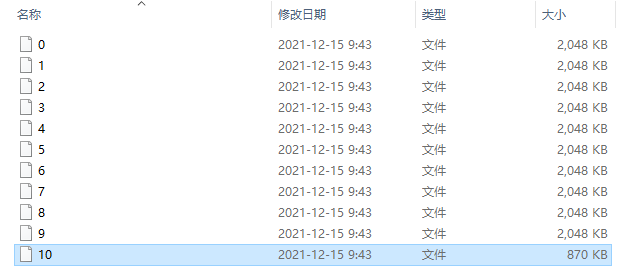
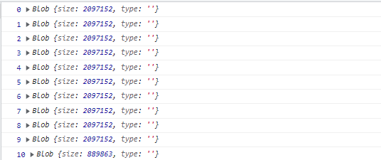

今天碰到一个文件损坏的bug。从系统下载之前上传的PDF文件，打开时会提示文件损坏，实际使用浏览器和WPS可以正常打开，使用Adobe Acrobat会提示文件已损坏。下面简单记录下整个bug的解决过程。

产生bug的功能是自己写的文件切片上传，基本过程是从前端将大于2M的文件拆分成数个最大2M的文件，然后将所有切片上传到后端，前端上传完所有切片会发一个消息告诉后端开始将所有切片合成原文件，后端合成完后再将文件的下载地址返回给前端。


### 1.首先从服务器上面copy下来上传的文件和原文件对比

从下图可以看出，上传后的文件的大小比原文件更大了，大了1017个字节，现在需要确认是在前端拆分的时候生成的文件变大了还是在后端文件合成的时候变大了


### 2.修改代码保留后端上传的临时文件，查看临时文件的大小是否正常



经观察发现，所有文件的字节数之和等于生成后的上传文件的字节数，2097152 * 10 + 890880 = 21862400，所以不是文件合成导致的


### 3.打印前端上传的切片文件，发现所有切片文件的字节数之和等于原文件的字节数之和，2097152 * 10 + 889683 = 21861383，所以可以确定，只有小于2M的切片被变大了，且是在前端文件上传后，后端文件合成前被变大的。



### 4.查看代码发现，在切片文件上传后，都有一个文件转存的过程，经过查看文件转存的代码，发现了小于2M的切片文件变大的原因。转存时由于代码的逻辑问题导致文件的部分字节被重复写了一次

原代码:

```java
/**
 * 将上传的文件保存到新文件中
 * @param uploadFile 上传的文件 MultipartFile
 * @param saveFile 新保存的文件
 */
public static void copyUploadFile(MultipartFile uploadFile, File saveFile) {
   byte[] data = new byte[1024];
   try(InputStream inputStream = uploadFile.getInputStream();
      BufferedInputStream bufferedInputStream = new BufferedInputStream(inputStream);
      OutputStream outputStream = new FileOutputStream(saveFile);
      BufferedOutputStream bufferedOutputStream = new BufferedOutputStream(outputStream)) {
       //当文件剩余的部分小于1024个字节时，data中不足1024的部分仍是上一个1024个字节的部分，直接write就导致那部分重新写了
      while (bufferedInputStream.read(data) > 0) {
         bufferedOutputStream.write(data);
         bufferedOutputStream.flush();
      }
   } catch (IOException e) {
      e.printStackTrace();
      throw new SrsException(300, "文件读取失败");
   }
}
```

修改后的代码：

```java
/**
 * 将上传的文件保存到新文件中
 * @param uploadFile 上传的文件 MultipartFile
 * @param saveFile 新保存的文件
 */
public static void copyUploadFile(MultipartFile uploadFile, File saveFile) {
   byte[] data = new byte[1024];
   try(InputStream inputStream = uploadFile.getInputStream();
      BufferedInputStream bufferedInputStream = new BufferedInputStream(inputStream);
      OutputStream outputStream = new FileOutputStream(saveFile);
      BufferedOutputStream bufferedOutputStream = new BufferedOutputStream(outputStream)) {
      int len = -1;
      while ((len = bufferedInputStream.read(data)) != -1) {
          //只写新读取到的字节数，不把1024个字节都写进去
         bufferedOutputStream.write(data, 0, len);
         bufferedOutputStream.flush();
      }
   } catch (IOException e) {
      e.printStackTrace();
      throw new SrsException(300, "文件读取失败");
   }
}
```
